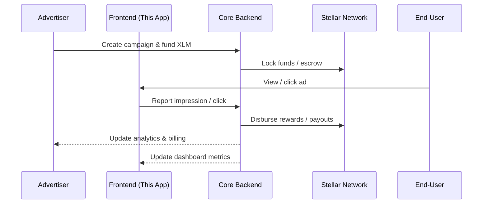
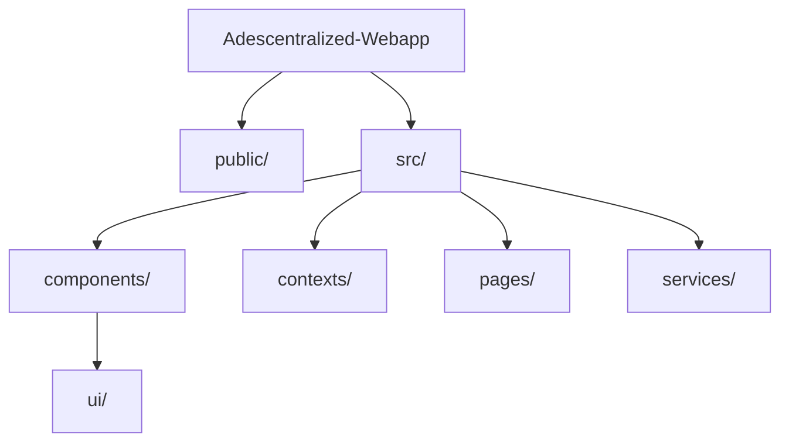

# Adescentralized – Web3 Campaign Platform (Frontend)

**A React + Vite + Tailwind application that enables advertisers to create and manage Web3 marketing campaigns, handle Stellar (XLM) transactions, and track campaign performance.**

> Part of the **Adescentralized** ecosystem — a Stellar‑powered, privacy‑first advertising platform with on‑chain verification and fair payouts to advertisers, publishers, and users.

---

## 🚀 Quick Start

### Prerequisites
- **Node.js 18+**
- **npm** or **bun**

### Installation

```bash
# Clone the repository
git clone <YOUR_GIT_URL>
cd Adescentralized-Webapp

# Install dependencies
bun install
# or
npm install

# Start development server
bun run dev
# or
npm run dev
```

Open [http://localhost:8080](http://localhost:8080) in your browser.

---

## 📋 Overview

### What is Adescentralized?

Adescentralized connects **advertisers**, **publishers**, and **users** in a transparent Web3 advertising marketplace:

* **Advertisers** create campaigns and pay only for **verified** impressions/clicks using XLM
* **Publishers** integrate campaign ads and receive automatic revenue splits
* **Users** interact with ads and receive **real XLM rewards** via Stellar blockchain

### Key Features

- 🎯 **Campaign Creation**: Create campaigns with media upload, XLM budgeting, and targeting
- 📊 **Analytics Dashboard**: Track impressions, clicks, CTR, and spending in real-time
- 💰 **XLM Wallet Integration**: Manage Stellar wallets, transfer funds, purchase credits
- 👤 **Profile Management**: User settings, notifications, account statistics
- 🔐 **Secure Authentication**: JWT-based auth with Stellar wallet generation

---

## 🏗️ Architecture

```mermaid
flowchart LR
  A[Advertiser Frontend<br/>(This App)] -->|API| B[Core Backend API]
  C[Publisher Platform] -->|API| B
  D[End-User<br/>(Viewer)] -->|Interacts| A
  B --> E[Stellar Network]
  style B fill:#f3f4f6,stroke:#111827,stroke-width:1px
  style E fill:#fff7ed,stroke:#92400e,stroke-width:1px
```




---

## 🛠️ Tech Stack

- **React 18 + Vite** (TypeScript)
- **TailwindCSS + ShadCN UI** components
- **React Router** for navigation
- **TanStack Query** for API state management
- **Stellar SDK** for XLM transactions
- **JWT Authentication** with automatic token management

---

## 📁 Project Structure

```
src/
├─ components/
│  ├─ AppSidebar.tsx         # Main navigation
│  ├─ Layout.tsx             # App layout wrapper
│  ├─ ProtectedRoute.tsx     # Auth guard
│  └─ ui/                    # ShadCN components
├─ contexts/
│  └─ AuthContext.tsx        # Auth state management
├─ pages/
│  ├─ Dashboard.tsx          # Campaign analytics
│  ├─ CreateCampaign.tsx     # Campaign creation
│  ├─ Credits.tsx            # XLM wallet management
│  ├─ Profile.tsx            # User settings
│  ├─ Login.tsx              # Authentication
│  └─ SignUp.tsx             # Registration
├─ services/
│  ├─ api.ts                 # Backend API client
│  └─ devMock.ts             # Development mock data
└─ App.tsx                   # Main app component
```



---

## 🎯 Core Features

### Campaign Creation
- Upload images/videos (up to 3 files, 5MB each)
- Set XLM budget and cost-per-click
- Target by age, interests, platforms
- Schedule start/end dates

### XLM Wallet Integration
- Automatic Stellar wallet creation
- Real-time balance checking
- Transfer XLM between users
- Credit package purchases

### Analytics Dashboard
- Campaign performance metrics
- Impression and click tracking
- Budget utilization monitoring
- Revenue and spend analysis

---

## 🔧 Configuration

### Backend API Configuration

Edit `src/services/api.ts`:
```typescript
const API_BASE_URL = 'http://localhost:3000'; // Backend URL
```

### Environment Variables

Create `.env.local`:
```env
VITE_API_BASE_URL=https://your-backend-api.com
VITE_STELLAR_NETWORK=testnet
VITE_ENABLE_DEBUG=false
```

---

## 📊 API Endpoints

### Authentication
- `POST /wallet/` - Register user
- `POST /auth/login` - User login

### Campaigns
- `POST /advertisements` - Create campaign
- `GET /advertisements/{userId}` - List campaigns
- `GET /dashboard/{userId}` - Analytics data

### Wallet
- `GET /wallet/balance/{email}` - Get balance
- `POST /wallet/transfer` - Transfer XLM

---

## 🚀 Deployment

### Build for Production

```bash
npm run build
```

Deploy `dist/` folder to:
- **Vercel** (recommended)
- **Netlify**
- **AWS S3 + CloudFront**

### Production Environment

```env
VITE_API_BASE_URL=https://api.adescentralized.com
VITE_STELLAR_NETWORK=public
VITE_ENABLE_DEBUG=false
```

---

## 🐛 Troubleshooting

### Common Issues

**Backend Connection Failed**
- App automatically falls back to mock data
- Check `API_BASE_URL` configuration
- Verify backend is running on correct port

**XLM Transfer Issues**
- Validate Stellar public key format
- Check sufficient XLM balance
- Ensure Stellar network connectivity

**Build Errors**
```bash
# Clear dependencies and reinstall
rm -rf node_modules bun.lockb
bun install
```

---

## 🔄 Development

### Available Scripts

```bash
npm run dev        # Development server
npm run build      # Production build
npm run build:dev  # Development build
npm run lint       # Code linting
npm run preview    # Preview build
```

### Mock Data
- Development includes comprehensive mock data
- Automatic fallback when backend unavailable
- Realistic campaign and user data

---

## 🤝 Contributing

1. Fork the repository
2. Create feature branch (`feature/new-feature`)
3. Follow ESLint and TypeScript guidelines
4. Test with both real API and mock data
5. Submit PR with detailed description

---

## 📄 License

MIT License - see LICENSE file for details

---

## 🌟 Adescentralized Ecosystem

This frontend is part of a larger Web3 advertising ecosystem that revolutionizes digital marketing through:

- **Blockchain Transparency**: On-chain verification of all transactions
- **Fair Revenue Sharing**: Automatic distribution to all stakeholders
- **User Rewards**: XLM payments for ad engagement
- **Privacy-First**: Contextual targeting without user tracking
- **Low-Cost Transactions**: Stellar's efficient payment network

**Version**: v1.0.0 | **Framework**: React 18 + Vite | **Blockchain**: Stellar (XLM)
